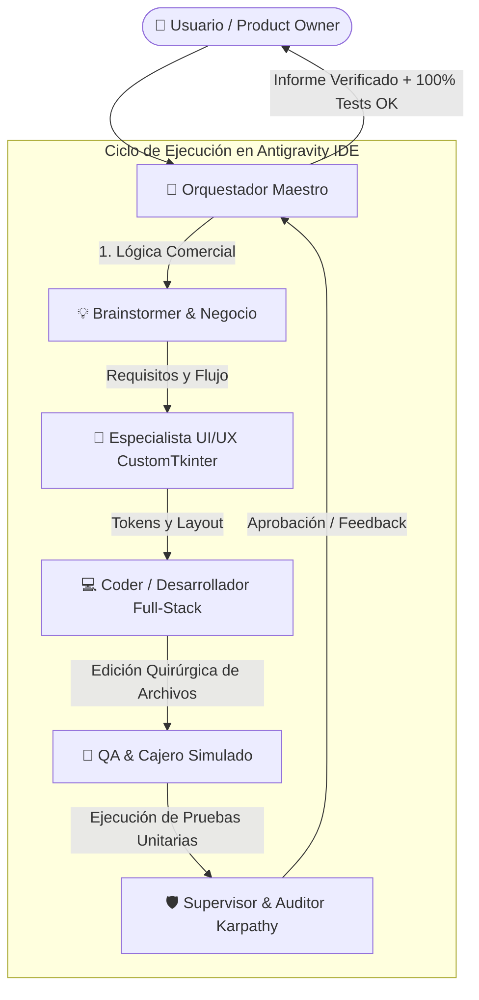

# 🏪 Kiosko POS — Autonomous AI Engineering Squad

> **Multi-Agent Engineering Framework para Google Antigravity IDE**  
> Diseñado bajo los principios de arquitectura limpia, verificación guiada por metas (*Goal-Driven Execution*) y las directrices de Andrej Karpathy (*Karpathy Guidelines*).

---

## 🌟 Visión General

**kiosko-agents** es un framework de ingeniería de software autónomo compuesto por un **Escuadrón Multi-Agente Especializado**. Cada agente asume una responsabilidad estricta dentro del ciclo de desarrollo (producto, UI/UX, desarrollo de software, testing de usuario y auditoría técnica), evitando la sobreingeniería y eliminando la ceguera del desarrollador único.

Este escuadrón fue probado exitosamente en el desarrollo y estabilización de **Kiosko POS — SaaS Edition (v2.1)**, logrando:
- 🛡️ Detección y corrección de un bug financiero crítico en arqueos de caja (`H-01`).
- 🔒 Detección y blindaje de la brecha de licenciamiento por hardware HWID (`H-02`).
- 🧪 Creación autónoma de una suite de **40 pruebas automatizadas (100% en verde)**.
- 🎨 Rediseño integral de la interfaz de usuario al estándar **Fintech Slate & Emerald**.

---

## 👥 Arquitectura del Escuadrón



### Roles del Sistema

| Agente | Especialidad | Responsabilidad Principal |
|---|---|---|
| **🧠 Orquestador** | Coordinación & Meta-Agente | Gestiona el ciclo de vida, activa los sub-roles y asegura que ninguna tarea se cierre sin verificación total. |
| **💡 Brainstormer** | Estrategia de Producto | Define la lógica comercial, márgenes, prevención de pérdidas, inflación en fiados y reglas de combos. |
| **🎨 Especialista UI/UX** | Diseño Desktop CustomTkinter | Diseña la ergonomía visual (Fintech Slate & Emerald), atajos de teclado (`F1-F4`, `Esc`), navegación por Sidebar y tablas oscuras. |
| **💻 Coder** | Full-Stack Python & SQLite | Escribe código quirúrgico directamente en los archivos del workspace respetando la arquitectura de 4 capas. |
| **🧪 QA & Cajero Simulado** | Testing & Simulación de Usuario | Actúa como usuario virtual: crea scripts en `tests/`, simula turnos de caja, ventas por peso y valida transacciones SQLite. |
| **🛡️ Supervisor** | Auditoría & Principios Karpathy | Audita contra código espagueti, previene sobreingeniería, verifica el bloqueo HWID y garantiza cero regresiones. |

---

## 📂 Estructura del Repositorio

```
kiosko-agents/
├── README.md                      # Esta documentación
├── LICENSE                        # Licencia MIT
├── .gitignore                     # Filtros de git
├── prompts/                       # Prompts Maestros listos para Antigravity IDE
│   ├── orchestrator_master.md     # Prompt maestro principal para el panel del agente
│   ├── uiux_redesign_prompt.md    # Prompt para refactorizaciones visuales y temas
│   └── feature_expansion.md       # Prompt para agregar pagos mixtos, combos e impresión
└── roles/                         # Definiciones modulares de cada especialista
    ├── 01_brainstormer.md         # Rol individual: Estratega de Producto
    ├── 02_uiux_specialist.md      # Rol individual: Especialista UI/UX
    ├── 03_coder.md                # Rol individual: Desarrollador Python
    ├── 04_qa_simulator.md         # Rol individual: Ingeniero de QA y Cajero Virtual
    └── 05_supervisor.md           # Rol individual: Supervisor y Auditor
```

---

## 🚀 Cómo Usar en Google Antigravity IDE

1. **Abre tu workspace:** Carga la carpeta de tu aplicación (ej. `kiosko/`) en Antigravity IDE.
2. **Abre el panel "Agent":** Ve a la barra lateral derecha de Antigravity IDE.
3. **Pega el Prompt Maestro:** Copia el contenido de [`prompts/orchestrator_master.md`](./prompts/orchestrator_master.md) y pégalo en el chat.
4. **Interactúa de forma natural:**
   - Para diagnosticar el proyecto: *"Ejecuta la misión inicial de diagnóstico y testing en tests/"*.
   - Para agregar funcionalidades: *"Quiero agregar pagos mixtos y combos en @tab_ventas.py"*.
   - Para rediseñar la UI: *"Aplica el rediseño Fintech Slate & Emerald con barra lateral"*.

---

## 📜 Regla Inquebrantable del Entorno (Zero Copy-Paste)

Todos los agentes de este framework tienen incorporada por diseño la restricción operativa:
> *"Tienes TERMINANTEMENTE PROHIBIDO generar bloques de código para que el usuario los copie y pegue manualmente. Debes utilizar tus capacidades integradas en el IDE para aplicar los cambios directamente en los archivos correspondientes, crear los archivos necesarios o guiar conceptualmente la arquitectura, pero nunca entregar código crudo como texto para copiar."*

---

## ⚖️ Licencia

Distribuido bajo la Licencia MIT. Consulta [`LICENSE`](./LICENSE) para más información.
